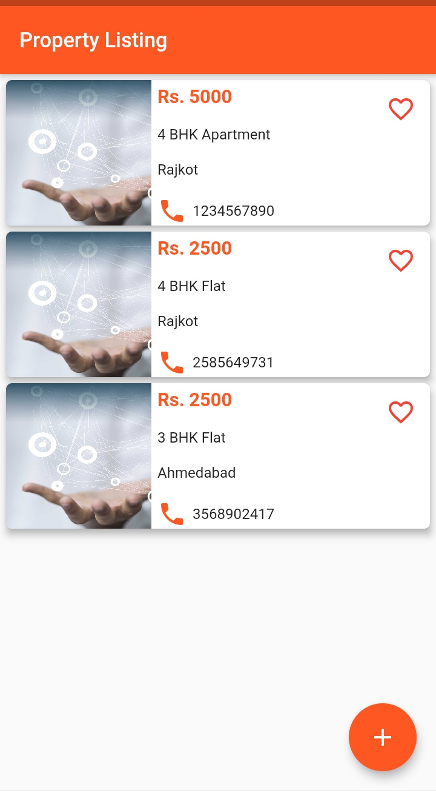
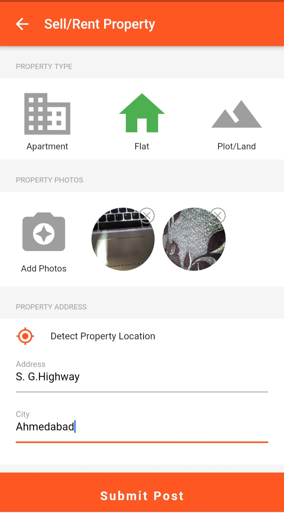
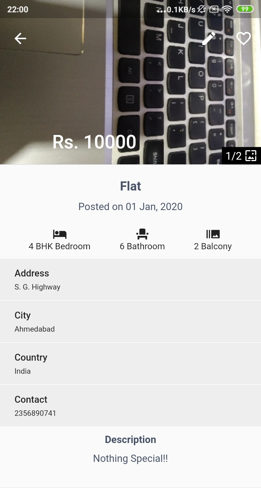
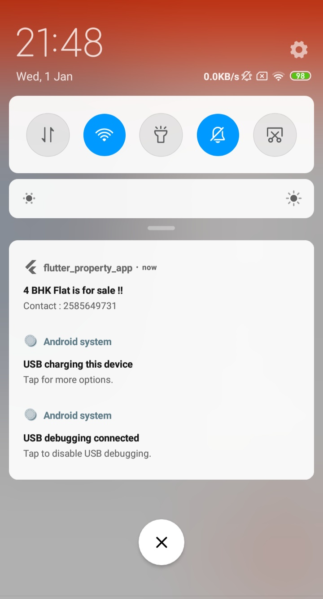

# Flutter Property

> A flutter application for property selling and listing app. 

Main Features Used :
- Beautiful UI Design
- Firebase Database
- Data Fetching From Network
- Multi ImagePicker With Image from URL or Local Uri
- Gallery Swiper
- Local Notification
- Fetch Current Location

## Screenshots

| 1 | 2|
|------|-------|
|||

| 3 | 4|
|------|-------|
|||

Don't forget to star :star2: the repo if you like our work.:heart::blue_heart::yellow_heart::purple_heart::green_heart:

## Website :link:

> [Toastguyz](www.toastguyz.com) - A programming tutorials website

## Support on social media :thumbsup:

>Follow us on our social media profiles to support us.

- [Youtube Channel](https://www.youtube.com/toastguyz)
- [Facebook Page](https://www.facebook.com/toastguyz)
- [Twitter Account](https://www.twitter.com/toastguyz)
- [Instagram Account](https://www.instagram.com/toastguyz)

## Code Developer

>### Jay Patel :fire:
>Enthusiastic Android & Flutter App Developer.

## ☕ Donate 

> [Paypal](https://www.paypal.me/toastguyz)

Thanks for reaching out to us. :100: 

# Getting Started

> 1. Create your flutter application project.
> 2. [Set up with firebase](https://firebase.google.com/docs)
> 3. Create Realtime Database with Test Rules.
> 4. Also, setup firebase storage in your firebase console.

    RealTime Database Rules : 
    {
        "rules": {
        ".read": true,
        ".write": true
        }
    }
    
    Storage Rules :
     
    service firebase.storage {
      match /b/{bucket}/o {
        match /{allPaths=**} {
          allow read, write;
         }
       }
    }

Now, you're ready to rock the floor:guitar: